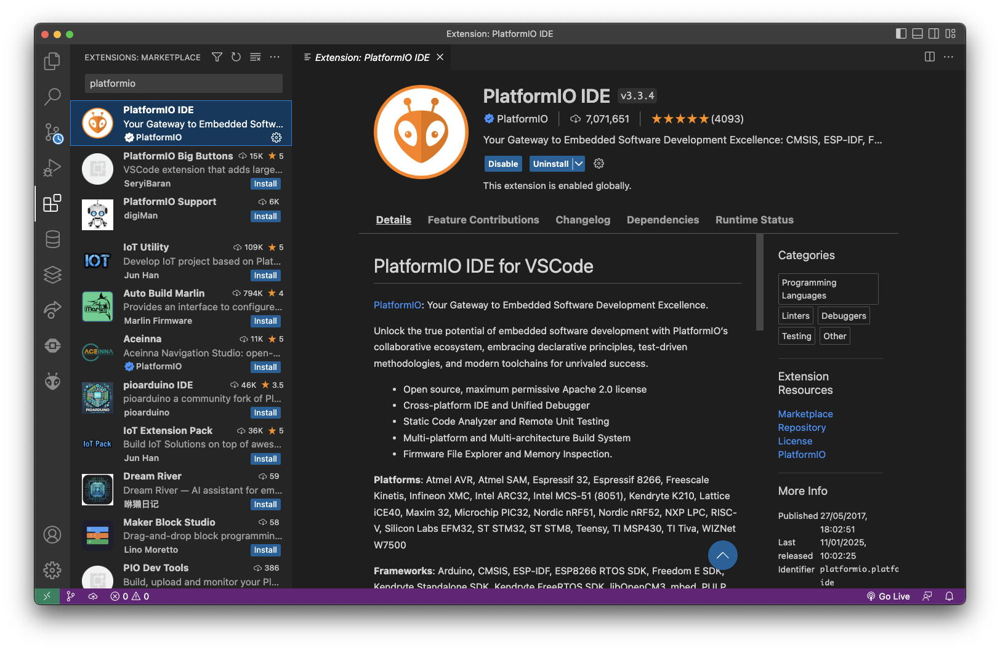
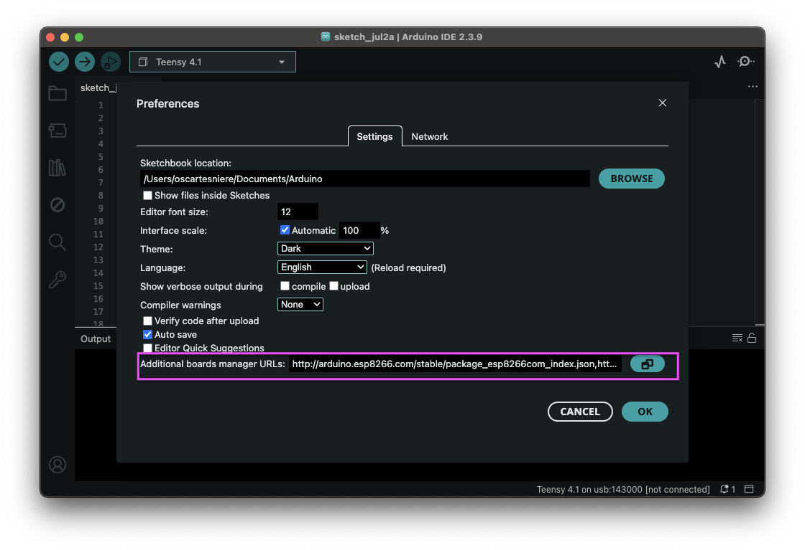
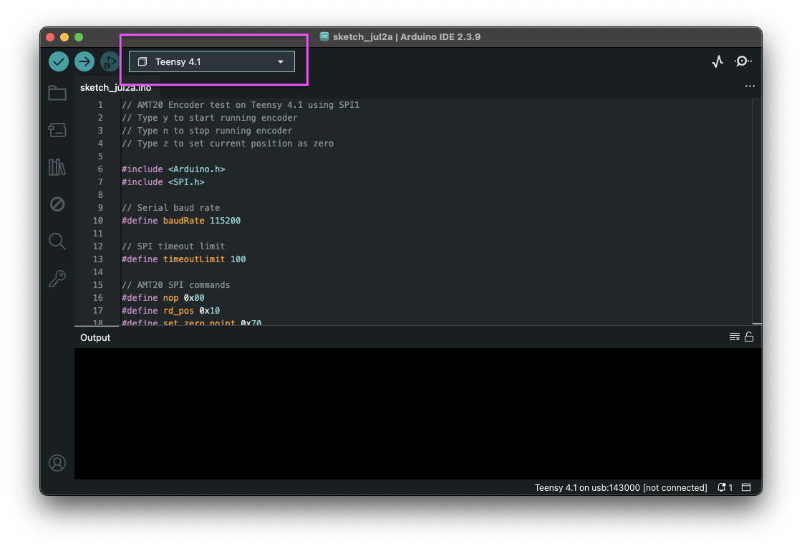

The software layer works as follows : 
* The Teensy 4.1 and Arduino Nano BLE33 Rev2 make part of the PCB software stack
* The main "server" running torque moment generation is a separate entity 

## Teensy and Arduino Nano programing environment and workflow :

### Platformio 

We chose platformio (abbreviated `pio`) for it's seamless integration with both the Arduino Nano and the Teensy.
The Arduino IDE supports both boards and architecture, however pio provides useful features key to our development : 
- All-in-one compile-upload-monitor pipeline for fast development
- Configurable environments to distinguish scripts that are to be run on the Teensy vs those to be run on the Arduino. The environments are defined in `platformio.ini`
- Easier project management for multiple sketches. The CLI-based nature of pio allows us to easily integrate version control (git) 

To run an environment (ex `myenv`) run in the same directory as `platormio.ini` the following command : `pio run -e myenv`

To monitor a specific device (`myport`) over the serial monitor run `pio device monitor --port myport`. To get the list of available ports run `ls /dev/cu*`

#### Platformio setup 

Platformio can be installed as a standalone application [`platformio cli`](https://docs.platformio.org/en/latest/core/index.html) which gives access to a command line interface for running direct commands. It is lightweight and does not rely on an overlaying IDE, however you must be familiar with CLI and know the commands to run for compiling/uploading/monitoring

Platformio is also available as an integration into popular IDEs like VScode, CLion [`platformio-ide`](https://docs.platformio.org/en/latest/integration/ide/pioide.html#pioide). We recommend using VScode because the graphical interface is easy to navigate through. 

To install platformio on vscode, locate the platformio plugin in the marketplace 

To install platformio on CLION, follow the instructions [here](https://www.jetbrains.com/help/clion/platformio.html#debug-prj)

### Setting up the Arduino IDE for compiling, uploading and monitoring the Teensy 4.1

_For reference : https://www.pjrc.com/teensy/tutorial.html_

The Arduino IDE doesn't provide a built-in board manager for the Teensy 4.1 board, so the first time setting up the Arduino IDE for the project you'll need to add this custom board manager URL from PJRC :

In the `Additional boards manager URLs` (`File > Preferences`) text box paste the following URL : 

`https://www.pjrc.com/teensy/package_teensy_index.json`

Wait for the IDE to install the board package, then make sure to choose the port labelled `Teensy 4.1`. Another port will show up when you plug the Teensy on your computer, but do not choose this one. 

